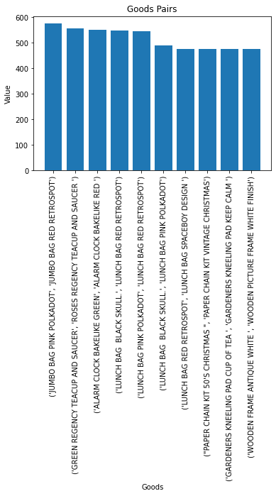

# Аналіз асоціативних правил в датасеті чеків

## Опис проекту
Цей проект був розроблений під час літньої практики в 2023 році. Головною метою була розробка алгоритму для виявлення та аналізу найсильніших пар товарів, які купуються разом, з використанням датасету чеків.

## Датасет
Датасет для цього проекту можна знайти та завантажити за наступним посиланням: [Online Retail Data Set]([URL_датасету](https://archive.ics.uci.edu/dataset/352/online+retail#)https://archive.ics.uci.edu/dataset/352/online+retail#).

## Технічні завдання
- Первинна обробка даних (Data Cleaning)
- Виявлення асоціативних правил (Association Rule Learning)
- Інтерпретація правил для рекомендацій товарів

## Результати
- Визначення топ-5 та топ-10 пар товарів
- Побудова візуалізацій з використанням бібліотеки Matplotlib

## Використані технології
- Python
- Pandas
- Matplotlib

## Встановлення
Для запуску цього проекту вам потрібно мати встановленим Python та наступні бібліотеки:
- Pandas: `pip install pandas`
- Matplotlib: `pip install matplotlib`

## Використання
Для аналізу асоціативних правил виконайте скрипт `python associative_rules_analysis.py` з командного рядка.
